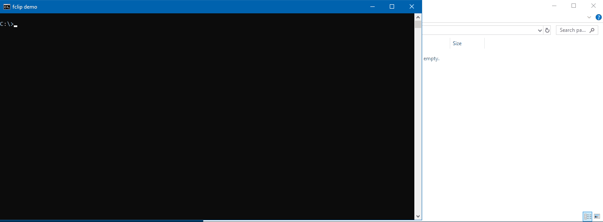

# fclip

In reference to the windows `clip` the ~~`fclip`~~ (see [Changes](#changes)) `fileclip` command copies files to the windows clipboard or pastes them from it.



**Breaking change in v2.1**

> At some point (mid 2022[?]) Microsoft introduced a `fclip.exe` (`C:\Windows\System32\fclip.exe`) which is totatlly unrelated to this project! Due to this fact the fclip project now deploys a **`fileclip.exe`**.

# Usage

    fileclip [-v | file1 [file2 [... [fileN]]]]

If you'd like a stable version use the [release](https://github.com/urbans0ft/fclip/releases)
provided.

## Copying

**Example:**

```
> fileclip file1.dat ..\file2.dat "C:\long folder\file3.dat" "C:\file4.dat"
```

`fileclip` supports relative and absolute paths. Moreover the path existence is
checked before modifying the clipboard data. If a path does not exist `fileclip`
returns `INVALID_FILE_ATTRIBUTES` wich is equivalent to -1.

```
> fileclip file-does-not-exist.dat
> echo %ERRORLEVEL%
-1
```

Press `ctrl + v` to paste the files.

## Pasting

```
> fileclip -v
```

`fileclip -v` checks if the clipboard contains a file reference and pastes it to
the current location. It simulates pressing `ctrl + v`.

## Version

```
> fileclip
fileclip Version 2.2.0
```

# Changes

- v2.2
	- Bug(s)
		- Fallback to paste by CF_HDROP if FILECONTENTS is not available.
	- Develop:
		- Enumerating clipboard formats in DEBUG mode.
- v2.1 **Breaking Changes**
	- Change(s): `fclip` becomes `fileclip` executable.
	- Develop: vscode project fully integrates cmake with gcc.

- v2.0 **Major Changes**

	- Bug(s):
		- support of relative file names (..\\..\\file.dat)
		- return value on copy failure (-1)
	- Change(s):
		- 64-bit only (since its 2022)
		- fclip version info
	- Develop:
		- UNICODE-only support:

			> Windows natively supports Unicode strings for UI elements, file names,
		  and so forth. Unicode is the preferred character encoding, because it
		  supports all character sets and languages. Windows represents Unicode
		  characters using UTF-16 encoding, in which each character is encoded as
		  one or two 16-bit values.

			_&mdash;[microsoft.com](https://learn.microsoft.com/en-us/windows/win32/learnwin32/working-with-strings)_

		- CMake build system
		- Increased verbosity

# Building

## Prerequisites

- cmake
- gcc (MinGW-w64)

Building is known to work with:

```
> cmake --version
cmake version 3.26.1

> g++ --version
g++.exe (x86_64-win32-seh-rev2, Built by MinGW-W64 project) 12.2.0

> systeminfo

OS Name:                   Microsoft Windows 10 Enterprise
OS Version:                10.0.19041 N/A Build 19041
```

## CMake

Example configuration and compilation assuming `g++` (MinGW-w64) is installed.

### Configuration

Generating the debug configuration:

```
..\fclip>cmake -G "MinGW Makefiles" -S . -B .\bin\debug\ -DCMAKE_BUILD_TYPE=Debug
-- The C compiler identification is GNU 12.2.0
-- The CXX compiler identification is GNU 12.2.0
-- Detecting C compiler ABI info
-- Detecting C compiler ABI info - done
-- Check for working C compiler: C:/mingw64/bin/gcc.exe - skipped
-- Detecting C compile features
-- Detecting C compile features - done
-- Detecting CXX compiler ABI info
-- Detecting CXX compiler ABI info - done
-- Check for working CXX compiler: C:/mingw64/bin/g++.exe - skipped
-- Detecting CXX compile features
-- Detecting CXX compile features - done
-- Configuring done
-- Generating done
```

Generating the release configuration: 

```
..\fclip>cmake -G "MinGW Makefiles" -S . -B .\bin\release\ -DCMAKE_BUILD_TYPE=Release
-- The C compiler identification is GNU 12.2.0
-- The CXX compiler identification is GNU 12.2.0
...
-- Configuring done
-- Generating done
```

### Compilation

After the successfull configuration the project may be compiled. If no changes to the CMake configuration files are made
there's no need to (re-)run it again. Instead the project may be (re-)compiled any time.

**Debug**

```
..\fclip>cmake --build bin\debug
[ 33%] Building CXX object CMakeFiles/fclip.dir/fclip.cpp.obj
[ 66%] Building CXX object CMakeFiles/fclip.dir/pch.cpp.obj
[100%] Linking CXX executable fileclip.exe
[100%] Built target fileclip
```

**Release**

```
..\fclip>cmake --build bin\release
[ 33%] Building CXX object CMakeFiles/fclip.dir/fclip.cpp.obj
[ 66%] Building CXX object CMakeFiles/fclip.dir/pch.cpp.obj
[100%] Linking CXX executable fileclip.exe
[100%] Built target fileclip
```

# References
* Inspired by [stackoverflow question](https://stackoverflow.com/q/25708895/10224443)
* [MinGW-w64](https://github.com/niXman/mingw-builds-binaries/releases)
* [CMake](https://cmake.org/download/)
